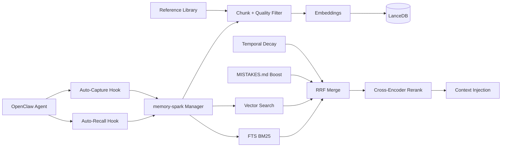
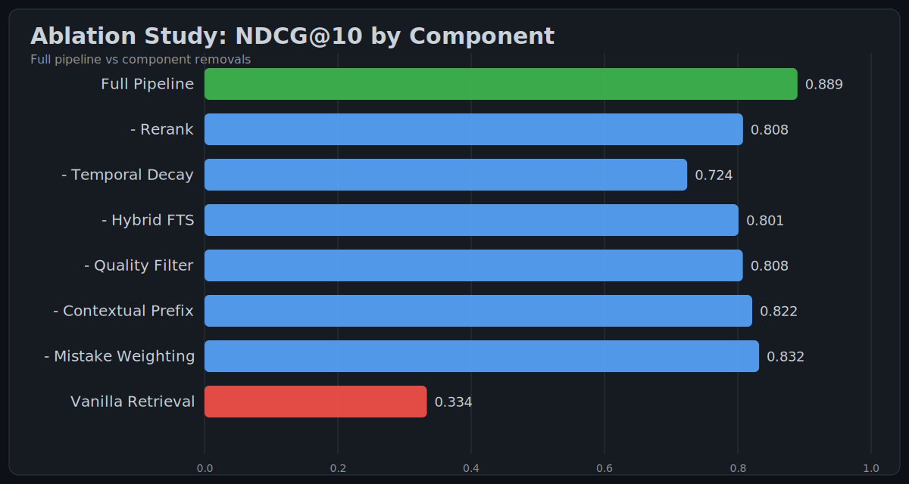
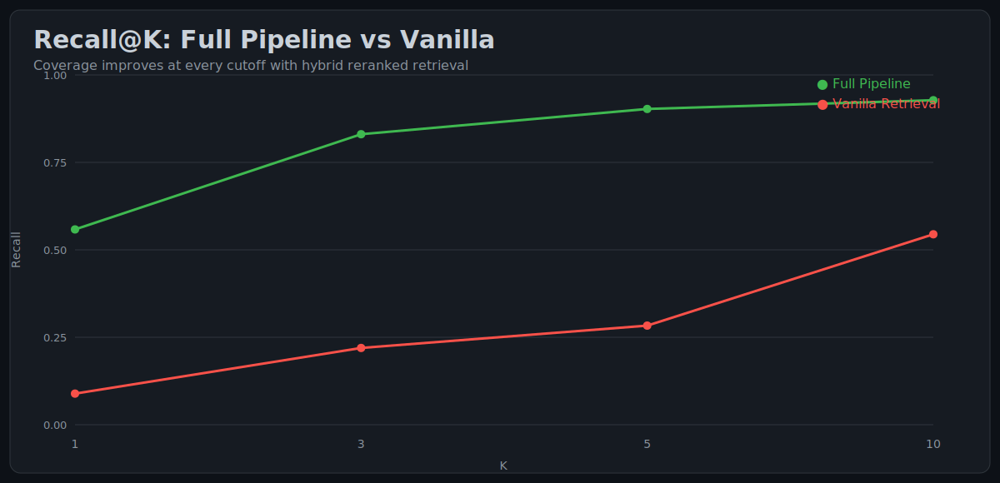
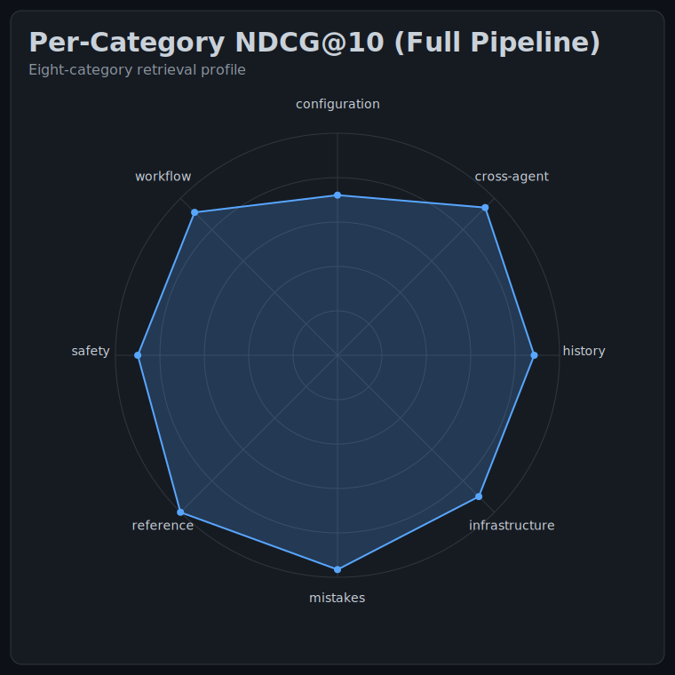
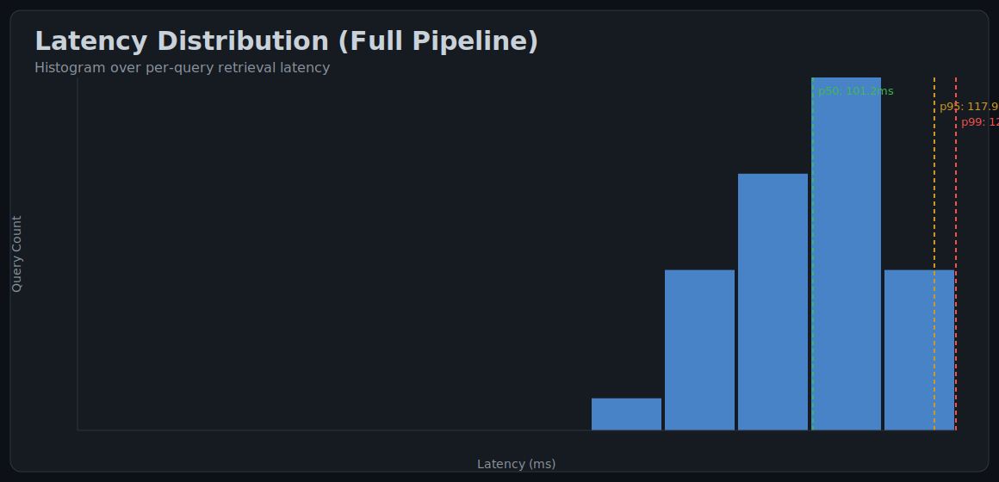

<div align="center">
  <h1>memory-spark ⚡</h1>
  <p><strong>GPU-Accelerated Persistent Memory for Autonomous AI Agents</strong></p>
  <p>Hybrid search · Cross-encoder reranking · Temporal decay · Contextual retrieval</p>

  <p>
    <a href="https://github.com/exampleuser/memory-spark/actions/workflows/ci.yml"></a>
    <a href="https://www.typescriptlang.org/"></a>
    <a href="./LICENSE"></a>
    <a href="https://nodejs.org/"></a>
    
  </p>

  <p>
    
    
    
  </p>
</div>

## Abstract
memory-spark is a production memory substrate for OpenClaw agents: it continuously ingests workspace knowledge, indexes it in LanceDB with hybrid dense+sparse retrieval, reranks candidates with a cross-encoder, and injects high-value context before each turn. The result is materially better recall of deployment-specific facts, safety constraints, and historical incidents while staying within low-latency budgets.

## Key Results
Results below are from `evaluation/results/latest.json` generated via `evaluation/run.ts --mock`.

| Metric | Full Pipeline | Vanilla Retrieval | Delta |
|---|---:|---:|---:|
| NDCG@10 | **0.889** | 0.334 | +0.556 |
| MRR | **0.941** | 0.306 | +0.635 |
| Recall@5 | **0.903** | 0.283 | +0.619 |
| MAP@10 | **0.841** | 0.274 | +0.567 |
| p95 latency | 117.9 ms | **72.0 ms** | +45.9 ms |

## Architecture


## Charts






## Installation & Quick Start
```bash
git clone https://github.com/exampleuser/memory-spark
cd memory-spark
npm ci
npm run build
```

In `~/.openclaw/openclaw.json` (or your OpenClaw plugin config):
```json
{
  "plugins": {
    "slots": { "memory": "memory-spark" },
    "allow": ["memory-spark"],
    "entries": {
      "memory-spark": {
        "enabled": true,
        "config": {
          "backend": "lancedb",
          "embed": {
            "provider": "spark",
            "spark": {
              "baseUrl": "http://SPARK_HOST:18091/v1",
              "apiKey": "${SPARK_BEARER_TOKEN}",
              "model": "nvidia/llama-embed-nemotron-8b"
            }
          },
          "rerank": {
            "enabled": true,
            "spark": {
              "baseUrl": "http://SPARK_HOST:18096/v1",
              "apiKey": "${SPARK_BEARER_TOKEN}",
              "model": "nvidia/llama-nemotron-rerank-1b-v2"
            }
          }
        }
      }
    }
  }
}
```

## Configuration Reference
Key configuration blocks:
- `backend`: `lancedb` or `sqlite-vec`
- `lancedbDir`: local vector/fts index path
- `embed`: provider/model/base URL
- `rerank.enabled`: cross-encoder reranking toggle
- `autoRecall`: injected memory limits (`maxResults`, `minScore`)
- `autoCapture`: autonomous memory extraction controls
- `watch`: workspace/session indexing controls
- `reference`: external documentation library paths and tags
- `ingest.minQuality`: chunk quality threshold

Full schema: `src/config.ts`.

## Evaluation & Reproducing Results
```bash
# 1) Generate evaluation outputs (mock mode; CI-safe)
npx tsx evaluation/run.ts --mock

# 2) Render publication-style SVG charts
npx tsx evaluation/charts.ts --results evaluation/results/latest.json

# Optional: single ablation configuration
npx tsx evaluation/run.ts --mock --no-rerank
npx tsx evaluation/run.ts --mock --no-decay
npx tsx evaluation/run.ts --mock --no-fts
npx tsx evaluation/run.ts --mock --no-quality
npx tsx evaluation/run.ts --mock --no-context
npx tsx evaluation/run.ts --mock --no-mistakes
```

## Ablation Study
| Configuration | NDCG@10 | MRR | Recall@5 |
|---|---:|---:|---:|
| **Full Pipeline** | **0.889** | **0.941** | **0.903** |
| - Rerank | 0.808 | 0.863 | 0.806 |
| - Temporal Decay | 0.724 | 0.722 | 0.783 |
| - Hybrid FTS | 0.801 | 0.866 | 0.800 |
| - Quality Filter | 0.808 | 0.855 | 0.794 |
| - Contextual Prefix | 0.822 | 0.880 | 0.789 |
| - Mistake Weighting | 0.832 | 0.881 | 0.875 |
| Vanilla Retrieval | 0.334 | 0.306 | 0.283 |

## Related Work
- Anthropic. Contextual Retrieval (2024)
- Sarthi et al. RAPTOR: Recursive Abstractive Processing for Tree-Organized Retrieval (2024)
- Asai et al. Self-RAG: Learning to Retrieve, Generate, and Critique (2024)
- Thakur et al. BEIR Benchmark (2021)
- Muennighoff et al. MTEB Benchmark (2023)
- Khattab and Zaharia. ColBERT (2020)
- Gao et al. HyDE (2023)

## Citation
```bibtex
@software{memory_spark_2026,
  title        = {memory-spark: GPU-Accelerated Persistent Memory for Autonomous AI Agents},
  author       = {Klein, Brok and Contributors},
  year         = {2026},
  url          = {https://github.com/exampleuser/memory-spark},
  version      = {0.1.0}
}
```

## License
MIT
