# memory-spark ⚡

**GPU-Accelerated Persistent Memory for Autonomous AI Agents**

<p align="center">
  <em>Hybrid search · RRF fusion · Dynamic reranker gate · Cross-encoder reranking · Contextual retrieval</em>
</p>

<p align="center">
  
  
  
  
</p>

<p align="center">
  
  
  
  
  
</p>

---

memory-spark is a production memory substrate for [OpenClaw](https://github.com/openclaw/openclaw) agents: it continuously ingests workspace knowledge, indexes it in LanceDB with hybrid dense+sparse retrieval, reranks candidates with a cross-encoder, and injects high-value context before each turn. The result is materially better recall of deployment-specific facts, safety constraints, and historical incidents while staying within low-latency budgets.

> **Paper:** See [`paper/memory-spark.pdf`](paper/memory-spark.pdf) for the full technical report.

## Benchmark Results (BEIR SciFact, 300 queries)

Results below are from `evaluation/results/` generated via `scripts/run-beir-bench.ts`.

| Metric | Full Pipeline (GATE-A) | Vector-Only Baseline | Delta |
|--------|----------------------|---------------------|-------|
| **NDCG@10** | **0.7802** | 0.7709 | **+0.94%** |
| **MRR** | 0.7455 | 0.7365 | +1.2% |
| **Recall@10** | **0.9137** | 0.9037 | **+1.1%** |
| **Latency** | 732ms | 528ms | +204ms |
| **Gate Skips** | 78% | — | — |

> **Note:** BEIR measures zero-shot cross-domain retrieval. Our eval is on standardized academic datasets (SciFact, FiQA, NFCorpus). See [docs/BENCHMARKS.md](docs/BENCHMARKS.md) for full analysis.

### Configuration Comparison

| Config | NDCG@10 | Description |
|--------|---------|-------------|
| **GATE-A** ★ | **0.7802** | Hard gate (production default) — 78% skip rate |
| GATE-D | 0.7803 | Soft gate + RRF k=20 |
| RRF-D | 0.7798 | RRF k=20, no gate |
| RRF-A | 0.7797 | RRF k=60, no gate |
| A: Vector-Only | 0.7709 | Baseline — no reranking, no hybrid |
| G: Full Pipeline | 0.7525 | Legacy score-based fusion |
| B: FTS-Only | 0.6523 | BM25 keyword search only |

## Architecture

```mermaid
flowchart LR
  A[Agent Turn] --> B[Query Clean]
  B --> C[HyDE]
  C --> D[Multi-Query]
  D --> E[Embed 4096d]

  E --> F[Vector Search]
  E --> G[FTS Search]
  F --> H[RRF Merge]
  G --> H

  H --> I[Source Weight]
  I --> J[Temporal Decay]
  J --> K[Source Dedup]

  K --> L{Reranker Gate}
  L -->|σ > 0.08 SKIP| N[MMR λ=0.9]
  L -->|σ < 0.02 SKIP| N
  L -->|0.02 ≤ σ ≤ 0.08| M[Cross-Encoder]
  M --> N

  N --> O[Parent Expand]
  O --> P[LCM Dedup]
  P --> Q[Security + Budget]
  Q --> R["&lt;relevant-memories&gt;"]

  S[Auto-Capture] --> T[(LanceDB)]
  E --> T
  T --> F
  T --> G

  style L fill:#132a13,stroke:#3fb950,stroke-width:2
  style M fill:#2d1117,stroke:#f85149
  style R fill:#1a1f2e,stroke:#58a6ff,stroke-width:2
```



### Full Architecture Diagram

<p align="center">
  
</p>

### Infrastructure Stack

| Component | Model | Port |
|-----------|-------|------|
| Embeddings | nvidia/llama-embed-nemotron-8b (4096d) | 18081 |
| Reranker | nvidia/llama-nemotron-rerank-1b-v2 | 18098 |
| LLM (HyDE) | Nemotron-Super-120B-A12B (NVFP4) | 18080 |
| NER | bert-large-NER | 18112 |
| Zero-shot | bart-large-mnli | 8013 |
| Storage | LanceDB (IVF_PQ + FTS) | local |

All ML inference runs on a local NVIDIA DGX Spark — **zero cloud API calls** for embeddings or reranking.

## Charts

### NDCG@10 by Configuration

<p align="center">
  
</p>

### Recall@10

<p align="center">
  
</p>

### Reranker Gate Decisions

<p align="center">
  
</p>

### Latency Comparison

<p align="center">
  
</p>

### Temporal Decay

<p align="center">
  
</p>

## Quick Start

```bash
git clone https://github.com/kleinpanic/memory-spark
cd memory-spark
npm ci
npm run build
```

### OpenClaw Plugin Configuration

In `~/.openclaw/openclaw.json`:

```json
{
  "plugins": {
    "slots": { "memory": "memory-spark" },
    "allow": ["memory-spark"],
    "entries": {
      "memory-spark": {
        "enabled": true,
        "config": {
          "backend": "lancedb",
          "embed": {
            "provider": "spark",
            "spark": {
              "baseUrl": "http://SPARK_HOST:18081/v1",
              "apiKey": "${SPARK_BEARER_TOKEN}",
              "model": "nvidia/llama-embed-nemotron-8b"
            }
          },
          "rerank": {
            "enabled": true,
            "rerankerGate": "hard",
            "blendMode": "rrf",
            "spark": {
              "baseUrl": "http://SPARK_HOST:18098/v1",
              "apiKey": "${SPARK_BEARER_TOKEN}",
              "model": "nvidia/llama-nemotron-rerank-1b-v2"
            }
          },
          "autoRecall": {
            "enabled": true,
            "agents": ["main", "dev", "meta"]
          },
          "autoCapture": {
            "enabled": true,
            "agents": ["main", "dev"]
          }
        }
      }
    }
  }
}
```

Key configuration blocks:

- **backend**: `lancedb` (default)
- **embed**: Provider/model/base URL for embeddings
- **rerank.enabled**: Cross-encoder reranking toggle
- **rerank.rerankerGate**: Dynamic gate mode (`hard`, `soft`, `off`)
- **rerank.blendMode**: Fusion strategy (`rrf`, `score`)
- **autoRecall**: Memory injection controls (maxResults, minScore, agents)
- **autoCapture**: Autonomous memory extraction (agents, quality thresholds)

Full schema: [`src/config.ts`](src/config.ts).

## Plugin Tools (18)

### Core Memory
| Tool | Purpose |
|------|---------|
| `memory_search` | Vector + FTS hybrid search across all knowledge |
| `memory_get` | Read a file by path and line range |
| `memory_store` | Store a fact, preference, or decision |
| `memory_forget` | Remove memories matching a query |
| `memory_forget_by_path` | Remove all chunks for a file path |
| `memory_bulk_ingest` | Batch store 1–100 memories in one call |

### Search & Discovery
| Tool | Purpose |
|------|---------|
| `memory_reference_search` | Search indexed reference docs (read-only pools) |
| `memory_temporal` | Time-windowed search ("what did I learn last week?") |
| `memory_related` | Find semantically similar memories by chunk ID |
| `memory_mistakes_search` | Search agent mistake patterns |
| `memory_rules_search` | Search shared rules across agents |

### Admin & Diagnostics
| Tool | Purpose |
|------|---------|
| `memory_mistakes_store` | Store a mistake pattern (1.6× recall boost) |
| `memory_rules_store` | Store a shared rule for all agents |
| `memory_inspect` | Simulate recall — see what would be injected |
| `memory_reindex` | Trigger re-index (single file or full scan) |
| `memory_index_status` | Health dashboard with pool/agent breakdown |
| `memory_recall_debug` | Full pipeline trace — see every stage's decisions |
| `memory_gate_status` | Show reranker gate configuration |

## Evaluation

```bash
# Run BEIR benchmark (specific configs)
npx tsx scripts/run-beir-bench.ts --dataset scifact --config A,GATE-A

# Full benchmark suite (all configs × all datasets, ~7-8h)
bash scripts/run-full-benchmark.sh

# Generate SVG charts from results
npx tsx evaluation/generate-charts.ts

# Compile LaTeX paper
cd paper && pdflatex memory-spark.tex
```

### Ablation Study

| Configuration | NDCG@10 | MRR | Recall@10 |
|--------------|---------|-----|-----------|
| Full Pipeline (GATE-A) | **0.7802** | 0.7455 | **0.9137** |
| − Reranker Gate | 0.7709 | 0.7365 | 0.9037 |
| − RRF (score blend) | 0.7525 | 0.7211 | 0.8924 |
| − FTS / Hybrid | 0.7278 | 0.6985 | 0.8924 |
| FTS-Only | 0.6523 | 0.6289 | 0.7867 |

## Key Innovations

### Dynamic Reranker Gate (§5 in paper)

The gate analyzes vector score distribution *before* calling the expensive cross-encoder:

- **σ > 0.08** (confident): Skip reranker → trust vector ranking
- **σ < 0.02** (tied set): Skip reranker → it's gambling on noise
- **0.02 ≤ σ ≤ 0.08** (ambiguous): Fire reranker → this is where it helps

Result: **78% of queries skip reranking** with no NDCG loss and **+1.1% recall improvement**.

### Reciprocal Rank Fusion (§6 in paper)

Replaces score-based hybrid merging. BM25 scores (5–20+) and cosine similarities (0.2–0.6) are on incompatible scales. RRF fuses by rank position only:

$$\text{RRF}(d) = \sum_{r \in R} \frac{w_r}{k + \text{rank}_r(d)}$$

Scale-invariant, no normalization needed.

## Project Structure

```
src/
  auto/          # Auto-recall (15-stage) + auto-capture hooks
    recall.ts    # Core pipeline: RRF, gate, MMR, parent expansion
    capture.ts   # Fact extraction + dedup (0.92 threshold)
  classify/      # NER, zero-shot, quality scoring
  embed/         # Provider, queue (circuit breaker), cache
  hyde/          # Hypothetical Document Embeddings
  ingest/        # File parsing, chunking, workspace discovery
  query/         # Multi-query expansion
  rerank/        # Cross-encoder + RRF blend + dynamic gate
  storage/       # LanceDB backend (IVF_PQ + FTS)
  security.ts    # Prompt injection detection
  config.ts      # Full config schema
index.ts         # OpenClaw plugin (18 tools + 3 hooks)
paper/           # LaTeX scientific paper
evaluation/      # BEIR benchmarks, chart generation
scripts/         # Diagnostics, migration, standalone tools
tests/           # 483 unit + integration tests
docs/            # Architecture, config, benchmarks, tuning
  figures/       # SVG charts (auto-generated)
```

## Documentation

| Doc | Content |
|-----|---------|
| [Architecture](docs/ARCHITECTURE.md) | System design, 15-stage pipeline |
| [Configuration](docs/CONFIGURATION.md) | Full config reference |
| [Benchmarks](docs/BENCHMARKS.md) | BEIR results, methodology |
| [Plugin API](docs/PLUGIN-API.md) | All 18 tools with examples |
| [Tuning Guide](docs/TUNING.md) | Threshold tuning, RRF, gate, MMR |
| [Technical Report](docs/TECHNICAL-REPORT.md) | Deep-dive engineering |
| [Changelog](docs/CHANGELOG.md) | Version history |
| [Paper (PDF)](paper/memory-spark.pdf) | Scientific paper |

## References

- Cormack et al. [Reciprocal Rank Fusion outperforms Condorcet and individual Rank Learning Methods](https://plg.uwaterloo.ca/~grcorcor/topicmodels/rrf.pdf) (SIGIR 2009)
- Gao et al. [HyDE: Precise Zero-Shot Dense Retrieval without Relevance Labels](https://arxiv.org/abs/2212.10496) (ACL 2023)
- Thakur et al. [BEIR: A Heterogeneous Benchmark for Zero-shot Evaluation of Information Retrieval Models](https://arxiv.org/abs/2104.08663) (NeurIPS 2021)
- Anthropic. [Contextual Retrieval](https://www.anthropic.com/index/contextual-retrieval) (2024)
- Packer et al. [MemGPT: Towards LLMs as Operating Systems](https://arxiv.org/abs/2310.08560) (2023)
- Khattab & Zaharia. [ColBERT: Efficient and Effective Passage Search](https://arxiv.org/abs/2004.12832) (SIGIR 2020)

## Citation

```bibtex
@software{memory_spark_2026,
  title   = {memory-spark: GPU-Accelerated Persistent Memory for Autonomous AI Agents},
  author  = {Klein, Brok and Contributors},
  year    = {2026},
  url     = {https://github.com/kleinpanic/memory-spark},
  version = {0.4.0}
}
```

## License

[MIT](LICENSE)
